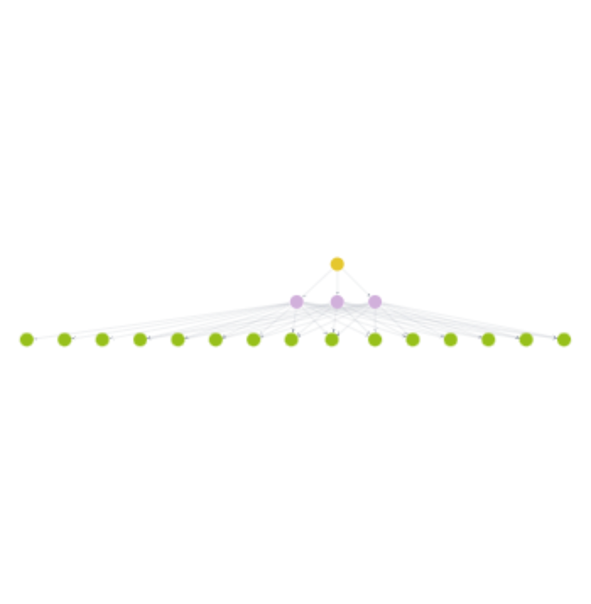

# Gerador de treino de musculação com matemática discreta

## Fazendo fork no repositório

Na sua IDE de preferência, abra o terminal e digite o seguinte código:

```
git clone https://github.com/Albuquerque07/discrete-training.git
```

Ele criará uma pasta com os arquivos do portifólio. Entre nela e digite no terminal da pasta:

```
pip install pandas, neo4j, numpy
```

## Entendendo o código

Darei uma ideia inicial em como o algoritmo foi estruturado para que todo processo seja entendido de forma mais leve. Articularei os seguintes pontos:
- Objetivo central
- Estruturação dos dados
- Sobre o Neo4j
- Pré-processamento dos dados
- Gerando treino full-body
- Gerando treino de hipertrofia


### Objetivo central
A ideia é gerar um treino de musculação para o usuário utilizando lógicas centradas na teoria de grafos de matemática discreta. O projeto é tanto um trabalho universitário quanto um projeto pessoal e foi utilizado de organização em POO para melhor estruturação da lógica.

### Estruturação dos dados
Utilizaremos grafos tripartidos para organizar nossos dados da seguinte forma:

* Vértices presentes: "GrupoMuscular" -> "Musculo" -> "Exercicio"

* Arestas: "POSSUI" e "É_ATIVADO"

* Pesos: Nas arestas de "É_ATIVADO" (Sendo de 0 a 1)

Os pesos representam o quanto um Músculo é ativado pelo Exercício a qual se relaciona.

### Sobre o Neo4j
Para garantir uma facilidadde na expansão, adicionamos uma database na nuvém com o Neo4j Aura, o que torna o programa mais escalável e de fácil acesso, além dessa database possuir lógica de grafos ao armazenar e organizar dados (Imagem de cima é da database). A linguagem de comunicação com a database é feita através do Cypher

Toda lógica de gerenciamento da database, no código, é feita pela classe "Neo4jDatabase" que recebe as credenciais de login do server e realiza a ação de verificar e fechar a conexão sempre que for chamada. Ela tem a capacidade de inserir código Cypher no banco, popular com vértices e relacionar os vértices através de arestas (relacionamentos)

### Pré-processamento dos dados

A pesquisa dos pesos em relação a músculos e exercícios foi feita inicialmente em um arquivo Excel. Tais dados foram tratados a partir da classe "ProcessadorDadosTreino" que recebe o local do arquivo. O método "_limpar_e_transformar" irá transformar os dados em um dataframe longo no seguinte formato:

>Múculo Principal   &nbsp;&nbsp;Músculo Secundário  &nbsp;&nbsp;Exercicio  &nbsp;&nbsp;&nbsp;&nbsp;&nbsp;&nbsp;&nbsp;&nbsp;&nbsp;&nbsp;&nbsp;&nbsp;&nbsp;&nbsp;&nbsp;&nbsp;&nbsp;&nbsp;&nbsp;Peso  
Peitoral  &nbsp;&nbsp;&nbsp;&nbsp;&nbsp;&nbsp;&nbsp;&nbsp;&nbsp;&nbsp;&nbsp;&nbsp;&nbsp;&nbsp;&nbsp;&nbsp;&nbsp;Peitoral superior  &nbsp;&nbsp;&nbsp;&nbsp;&nbsp;&nbsp;&nbsp;&nbsp;Supino inclinado 30°  0.40

Daí o método "processar" irá separar os valores em um dataframe de músculos únicos e uma lista de exercícios únicos para melhor serem inseridos na database posteriormente.

### Gerando treino Full-Body

Utilizando os dados processados pela classe `ProcessadorDadosTreino`, construímos uma **Matriz de Adjacência Ponderada** onde as linhas representam os **Grupos Musculares** e as colunas representam os **Exercícios**. O peso de cada célula $(i, j)$ corresponde à soma dos Scores MVIC do exercício $j$ para aquele grupo $i$.

O algoritmo aplica o método `_algoritmo_hungaro` (implementação do algoritmo de Kuhn-Munkres) para resolver o **Problema de Emparelhamento Perfeito de Peso Mínimo** (*Minimum Weight Perfect Matching*) em grafos bipartidos.

Como nosso objetivo é **MAXIMIZAR** a eficiência biomecânica (Score), realizamos uma transformação linear na matriz de entrada, negativando seus valores (multiplicação por -1). Os índices ótimos retornados pela função são então mapeados de volta aos nomes originais para compor a lista de dicionários contendo o treino de cada dia passado como parâmetro.

### Gerando treino de hipertrofia

Primeiramente, pegamos a matriz de Músculos x Exercícios e limitamos ela apenas aos músculos selecionados na função. Após isso, somamos os scores para cada linha de Músculos e colocamos em ordem decrescente para posteriormente filtrar apenas os k maiores scores de exercícios.


## Teoria do Algoritmo Húngaro (Treino Full-Body)

O problema a ser resolvido é encontrar um **Matching Perfeito de Peso Máximo** em um grafo bipartido. Devemos selecionar um conjunto de arestas que ligam cada vértice de $U$ (Grupos Musculares) a exatamente um vértice de $V$ (Exercícios), de forma que a soma dos pesos dessas arestas seja maximizada. Lembrando que o algoritmo resolve MINIMIZAÇÃO, porém iremos passar uma matriz negativa para que se torne MAXIMIZAÇÃO

Na função "_algoritmo_hungaro" vamos iniciar 4 arrays de zeros:  
* `u`: Potenciais das linhas i (Grupos Musculares),  
* `v`: Potenciais das colunas j (Exercícios),  
* `p`: Array de emparelhamento (Matching). Ex:  `p[j] = i` indica que a coluna `j` está emparelhada com a linha `i`,  
* `way`: Array auxiliar para reconstruir o caminho de aumento. `way[j]` é a coluna que viemos para chegar na coluna `j`

```python
u = np.zeros(num_linha + 1)
v = np.zeros(num_colunas + 1)
p = np.zeros(num_colunas + 1, dtype=int)
way = np.zeros(num_colunas + 1, dtype=int)
```

Agora iremos iterar por cada Grupo Muscular para tentar liga-lo a um exercício por um caminho de aumento. `j0` será nossa coluna atual.

```python
for i in range(1, num_linha + 1):
    p[0] = i
    j0 = 0
```

Criaremos agora a variável minv, que irá guardar os custos mínimos das arestas para adicionar na coluna j de exercício, e used, que vai dizer (por bool) quais colunas já visitamos:

```python
minv = np.full(num_colunas + 1, float('inf'))
used = np.zeros(num_colunas + 1, dtype=bool)
```

Iniciando agora a busca efetiva por caminhos de aumento. Vamos atribuir a coluna atual como utilizada (used[j0] = True), iremos criar uma variável que guarda o menor valor encontrado em `minv` (delta = float('inf')), iremos também criar `j1` que será a próxima coluna que iremos nos mover (que tem o menor delta atual)

```python
while True:
    used[j0] = True
    i0 = p[j0]
    delta = float('inf')
    j1 = 0
```

Agora vamos calcular o custo reduzido atribuído a linha i, que estamos, e iterando em cada coluna j de exercícios. Sabendo que `CustoReduzido = CustoOriginal - PotencialLinha - PotencialColuna` nos diz quão longe a aresta está de ser "ótima". Se o CustoReduzido for 0, é uma candidata perfeita. Se for menor que o atual `min[j]`, atualizamos o valor e marcamos em `way` que chegamos lá vindo de ``j0``.

```python
for j in range(1, num_colunas + 1):
    if not used[j]:
        custo_reduzido = matriz_custo[i0-1, j-1] - u[i0] - v[j]
        
        if custo_reduzido < minv[j]:
            minv[j] = custo_reduzido
            way[j] = j0
        
        if minv[j] < delta:
            delta = minv[j]
            j1 = j
                
```

Se não encontramos um caminho direto (zero imediato), atualizamos os potenciais u e v usando o valor de delta. Isso altera o grafo matematicamente, fazendo com que novas arestas tornem se viáveis, permitindo que a busca continue sem violar as restrições.

```python
for j in range(num_colunas + 1):
    if used[j]:
        u[p[j]] += delta
        v[j] -= delta
    else:
        minv[j] -= delta
```

Para encerrar o `while True` de procura por caminhos aumentados, queremos que a linha que está ligada ao ``j0`` seja igual a zero, significando que o Exercício está livre (Nenhum Grupo Múscular está usando)

```python
j0 = j1
if p[j0] == 0:
    break
```

Agora realizamos a troca das arestas ao longo do caminho encontrado. Usando o vetor ``way``, voltamos do exercício livre até o início. Cada exercício no caminho "troca de par", acomodando o novo Grupo Muscular ``i`` e realocando os anteriores para garantir que todos tenham um par ótimo.

```python
while True:
    j1 = way[j0]
    p[j0] = p[j1]
    j0 = j1
    if j0 == 0:
        break
```


## Abordagem Gulosa para o Problema da Mochila com Pesos Unitários (Treino de Hipertrofia)

O problema consiste em formar um treino que maximize a soma dos pesos das arestas entre um subconjunto de vértices de Músculos (Alvo) e Exercícios, respeitando uma restrição de cardinalidade (número máximo de exercícios).

Modelaremos este cenário como uma variação do **Problema da Mochila 0-1 (Knapsack Problem)**:
* **A Mochila:** O Treino, com capacidade limitada a $k$ slots.
* **Os Itens:** Exercícios disponíveis.
* **O Peso ($w$):** Unitário ($w = 1$), pois cada exercício ocupa exatamente 1 slot no treino.
* **O Valor ($v$):** Score MVIC total (soma da ativação muscular nos músculos-alvo).

Utilizamos uma **Abordagem Gulosa (Greedy Approach)**.
Embora o Problema da Mochila genérico exija Programação Dinâmica para encontrar a solução ótima, no caso específico de **Pesos Unitários**, a estratégia gulosa de selecionar os itens de maior valor é comprovadamente a solução ótima global.


Primeiro, expandimos os Grupos Musculares pedidos (ex: "Peito") para seus vértices constituintes (subgrupos como "Peitoral Maior", "Peitoral Menor") utilizando um conjunto (`set`) para evitar duplicatas.

```python
musculos_alvo = set()
for grupo in grupos_alvo:
    if grupo in mapa_grupos:
        musculos_alvo.update(mapa_grupos[grupo])
```

Criaremos uma matriz contendo apenas as linhas dos músculos de interesse. E então somamos os scores verticalmente para obter o Valor Total de cada exercício neste contexto específico.

```python
musculos_validos = [m for m in musculos_alvo if m in matriz_detalhada.index]

matriz_focada = matriz_detalhada.loc[musculos_validos]

score_total_por_exercicio = matriz_focada.sum(axis=0)
```

Ordenamos os exercícios de forma decrescente pelo score total e selecionamos os $k$ primeiros `(head(num_exercicios))`. Esta etapa garante que estamos preenchendo a "mochila" com os itens de maior valor possível.

```python
exercicios_ordenados = score_total_por_exercicio.sort_values(ascending=False)
top_k = exercicios_ordenados.head(num_exercicios)
```

Por fim, iteramos sobre os exercícios selecionados para recuperar os detalhes de ativação (quais músculos específicos cada um ativa) e formatamos a saída.

```python
treino_gerado = []
for exercicio, score in top_k.items():
    if score == 0: continue
        
    detalhes = matriz_focada[exercicio][matriz_focada[exercicio] > 0]
    
    treino_gerado.append({
        "exercicio_escolhido": exercicio,
        "score_mvic_total": round(score, 2),
        "musculos_ativados": detalhes.to_dict()
    })
    
return treino_gerado
```
